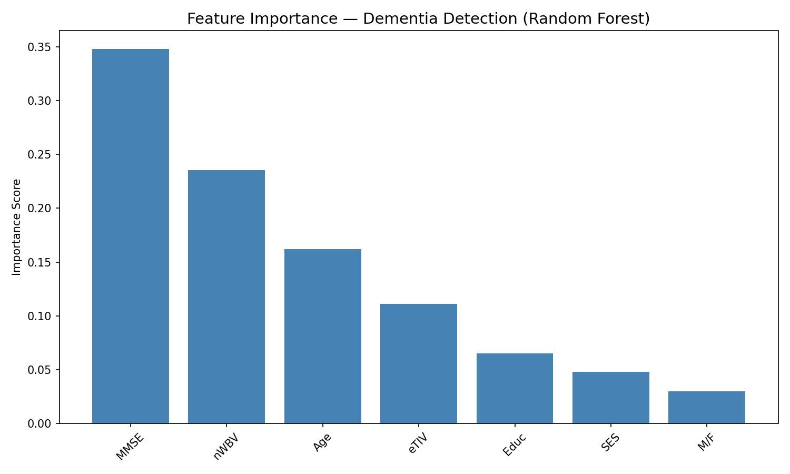
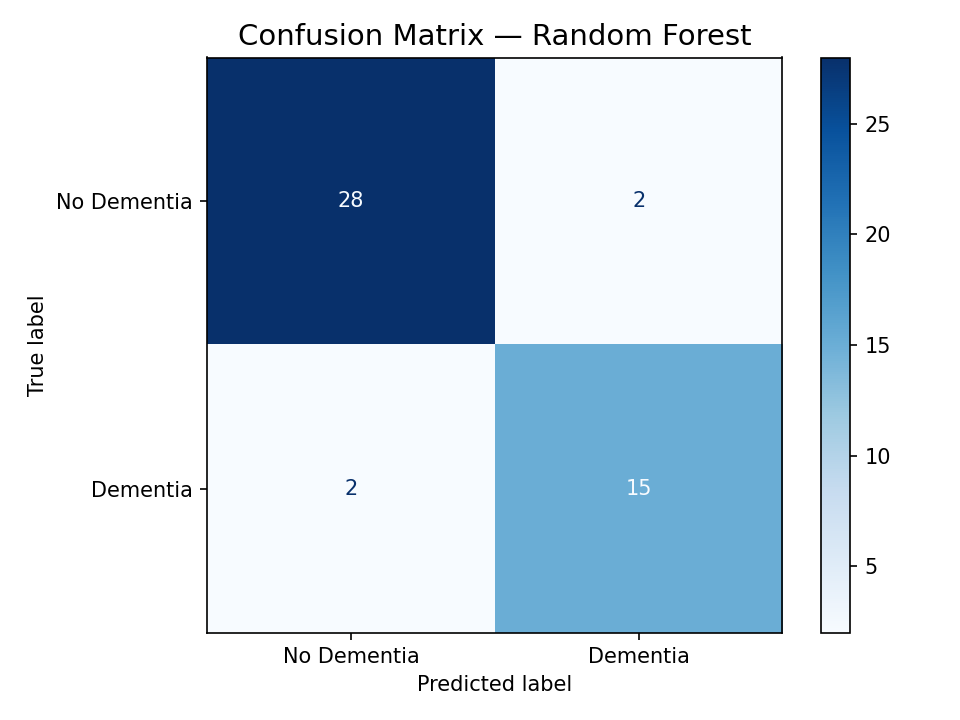

# dementia-detection-ml
# Early Detection of Cognitive Decline & Dementia using Machine Learning

## Overview
Dementia symptoms are often identified too late for effective intervention. 
This project applies machine learning to predict early cognitive decline 
using clinical and neuroimaging metadata from the OASIS-1 dataset (235 patients).
Trained and compared three models, validated with cross-validation, and 
deployed as a live web application.

## Dataset
- **Source:** OASIS-1 Cross-Sectional Dataset (oasis-brains.org)
- **Patients:** 235 (after removing non-assessed young controls)
- **Features:** MMSE, nWBV, Age, eTIV, Education, SES, Gender

## Models & Results
| Model | Accuracy | F1 (Dementia) |
|---|---|---|
| Logistic Regression | 80.85% | 0.7097 |
| Random Forest | 91.49% | 0.8824 |
| SVM | 76.60% | 0.6452 |

## Key Findings
- Random Forest achieved 91.49% accuracy and 0.88 F1 on dementia detection
- MMSE and nWBV were the strongest predictors (58.3% combined feature importance)
- MMSE captures cognitive performance; nWBV captures physical brain atrophy
- 5-fold cross-validation confirmed generalisation: mean F1 79.2% (σ=0.035)
- Single-split F1 of 88% was slightly optimistic vs cross-validated 79.2%

## Feature Importance

## Confusion Matrix

## Deployment
Live web application built with Streamlit — accepts patient clinical inputs 
and returns dementia risk prediction with confidence score.

## Limitations
- Dataset size of 235 patients is small by clinical standards
- Model requires validation on larger, more diverse populations
- Not a substitute for clinical diagnosis

## Tech Stack
Python · Scikit-Learn · Pandas · NumPy · Matplotlib · Streamlit · Joblib

## Author
Aisha Shahid Khan — B.Tech CS (AI & ML), CBIT Hyderabad
